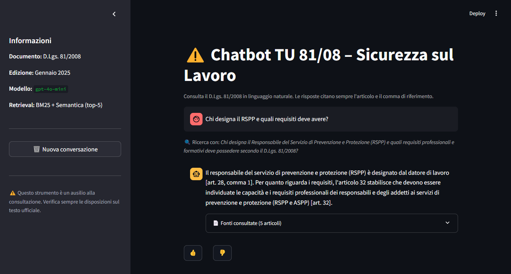
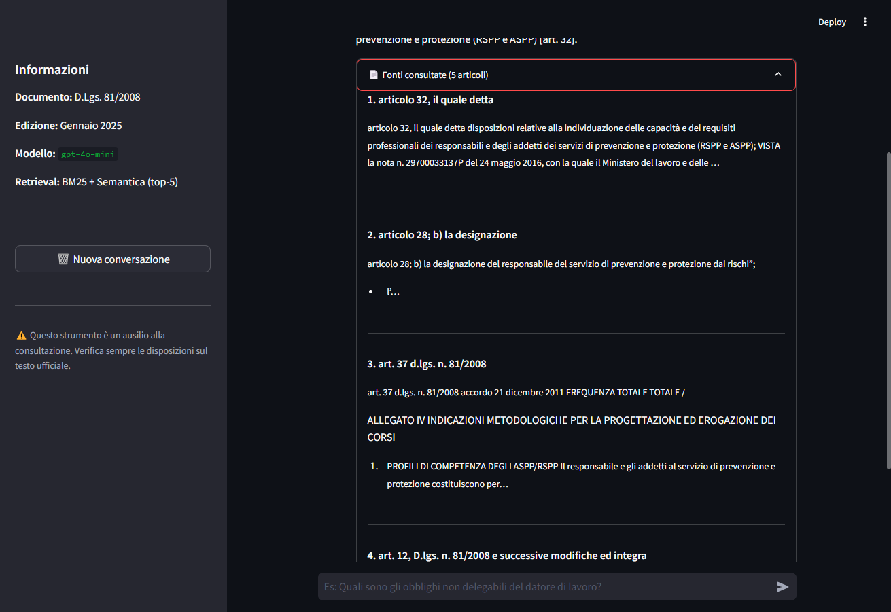
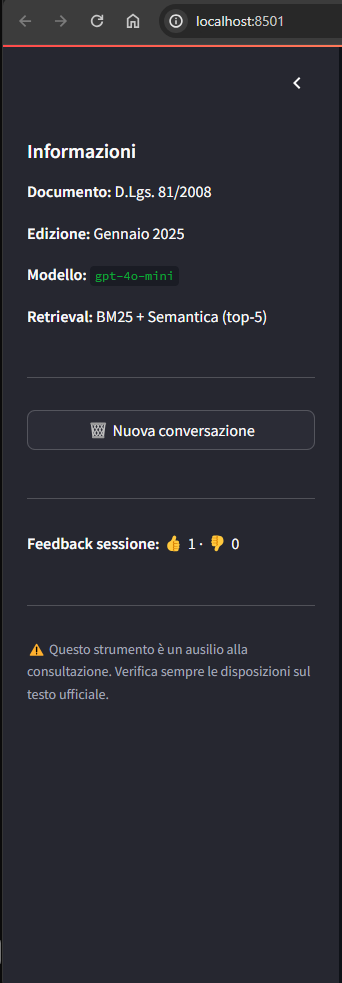

# Chatbot TU 81/08 – D.Lgs. 81/2008 Sicurezza sul Lavoro (RAG)

Sistema RAG per interrogare in linguaggio naturale il **Testo Unico sulla Sicurezza sul Lavoro (D.Lgs. 81/2008)**.
Ogni risposta cita obbligatoriamente l'articolo e il comma di riferimento. Valutato su 20 domande con ground truth.



---

## Risultati

| Metrica | Baseline | Finale | Var % |
|---------|:--------:|:------:|:-----:|
| Hit Rate@5 | 0.45 | **0.80** ✅ | +78% |
| MRR | 0.34 | **0.67** | +97% |
| Faithfulness (1–5) | 3.40 | **4.00** | +18% |
| Relevance (1–5) | 2.65 | **4.00** | +51% |
| Fallback (domande senza risposta) | 2/20 | **0/20** | −100% |

Progressione completa in 5 cicli di tuning → [`outputs/eval/comparison_report.md`](outputs/eval/comparison_report.md)

---

## Applicabilità in ambito operations e supply chain

Questo progetto non è solo un esercizio tecnico. Il problema che risolve — e il metodo con cui è stato sviluppato — sono direttamente trasferibili al contesto operations.

**Il problema operativo:** Un RSPP (Responsabile Servizio Prevenzione e Protezione) di uno stabilimento produttivo deve rispondere rapidamente a domande su obblighi, sanzioni e procedure senza sfogliare 198 pagine di normativa. Lo stesso problema si presenta ogni volta che un professionista deve recuperare informazioni precise da un corpus documentale esteso: specifiche tecniche prodotto, SLA contrattuali con i fornitori, procedure operative di stabilimento, manuali qualità ISO.

**Il metodo è identico al miglioramento continuo:** Il progetto è stato sviluppato con un approccio iterativo guidato dai dati — baseline → identificazione del gap → intervento mirato → misurazione → iterazione successiva. In 5 cicli la metrica principale è passata dal 45% all'80%. È la stessa logica del PDCA applicata a un sistema AI.

**Le decisioni prese sono decisioni di business:** Ogni scelta tecnica è stata guidata da un vincolo operativo reale — budget zero, latenza accettabile, zero allucinazioni su testo normativo, utente professionale con bassa tolleranza all'errore. Non ottimizzazione accademica: trade-off concreti.

**L'architettura è domain-agnostic:** Sostituendo il corpus (il PDF del TU 81/08) con qualsiasi altra documentazione strutturata — catalogo componenti, database fornitori, contratti quadro — il sistema funziona allo stesso modo. Il codice è parametrizzato via `config.yaml`; non richiede modifiche per cambiare dominio.

---

## Screenshot

| Chat + query rewriting | Fonti consultate | Sidebar + feedback |
|:---------------------:|:----------------:|:-----------------:|
|  |  |  |

La query viene riscritta automaticamente con terminologia giuridica prima del retrieval (visibile in corsivo sotto la domanda). Le fonti mostrano i 5 articoli recuperati. Il sidebar traccia il feedback utente 👍/👎 per sessione.

---

## Decisioni di progetto — Framework A→F

Prima di scrivere codice, ogni sistema RAG richiede di rispondere a 6 categorie di domande.
Di seguito le domande chiave per categoria e la scelta effettuata in questo progetto.

---

### A. Dati e Documenti

Le prime decisioni riguardano la natura del corpus: cosa si indicizza, in che volume, con quale frequenza cambia e come è strutturato internamente.

| Domanda | Perché conta |
|---------|-------------|
| Quali formati supportare? | Determina il parser, le dipendenze e la complessità del preprocessing |
| Qual è il volume di documenti? | Guida la scelta del vector store e i costi di embedding |
| Con che frequenza si aggiorna il corpus? | Determina se serve re-indicizzazione automatica o manuale |
| I documenti hanno struttura interna rilevante? | Influenza la strategia di chunking e la qualità del retrieval |
| Esistono documenti sensibili? | Impatta autenticazione, filtering e compliance GDPR |

> **Scelta in questo progetto**
>
> - **Formato:** PDF testuale (198 pag., D.Lgs. 81/2008 Ed. Gennaio 2025) — parser `pypdfium2`, scelto per basso consumo RAM su Windows rispetto a `pdfplumber` che causava MemoryError
> - **Volume:** 1 documento → 8.990 chunk (stima iniziale 300: errore di 25×, ogni comma/lettera è un chunk separato)
> - **Aggiornamento:** corpus statico, full rebuild manuale con `make build-index` a ogni nuova edizione
> - **Struttura:** il TU 81/08 ha gerarchia precisa (Titolo → Capo → Articolo → Comma → Lettera) — chunking per articolo preserva l'unità normativa citabile
> - **Accesso:** testo di legge pubblico, nessun vincolo di accesso

---

### B. Utenti e Casi d'Uso

Capire chi usa il sistema e come cambia tutto: formato della risposta, lunghezza del contesto, tipo di retrieval, design dell'interfaccia.

| Domanda | Perché conta |
|---------|-------------|
| Chi sono gli utenti e qual è il loro livello tecnico? | Determina il design dell'interfaccia e il formato delle risposte |
| Che tipo di domande faranno? | Guida la strategia di retrieval, il top-k e la struttura del prompt |
| Quanti utenti simultanei sono previsti? | Impatta architettura di deployment e scalabilità |

> **Scelta in questo progetto**
>
> - **Utente:** RSPP (profilo tecnico-normativo, alta tolleranza alla precisione, bassa tolleranza all'errore) — le risposte sono concise con citazione obbligatoria articolo+comma
> - **Tipo di domande:** fattuali puntuali ("Chi designa il RSPP?"), definizioni ("Cos'è il DVR?"), procedurali ("Come si redige il DVR?"), sanzionatorie — tutti i tipi coperti con top-k=5
> - **Deployment:** Streamlit single-process locale — zero infrastruttura, sufficiente per demo e portfolio

---

### C. Qualità e Affidabilità

In ambito normativo e operativo l'errore ha conseguenze reali. Questa sezione definisce come il sistema gestisce incertezza, fonti e domande fuori dominio.

| Domanda | Perché conta |
|---------|-------------|
| Qual è la tolleranza agli errori (allucinazioni)? | Determina temperature, guardrail nel prompt e soglie di fallback |
| Le fonti devono essere citate? | Influenza struttura dei metadata, formato del prompt e fiducia dell'utente |
| Cosa fare se la domanda non è coperta? | Impatta fallback logic e soglia di similarity |

> **Scelta in questo progetto**
>
> - **Tolleranza:** BASSA — contesto normativo non ammette imprecisioni. `temperature=0.0`, SYSTEM_PROMPT con istruzione esplicita "Usa SOLO le informazioni contenute negli articoli del contesto"
> - **Citazioni:** Livello 3 — articolo + comma + lettera: `[art. 17, comma 1, lett. a)]` obbligatorio in ogni risposta
> - **Fallback:** `min_similarity=0.55` — sotto soglia il sistema risponde "Non ho trovato questa informazione nel TU 81/08 tra gli articoli disponibili" senza chiamare il LLM (0 allucinazioni su query fuori dominio)

---

### D. Architettura e Infrastruttura

Le scelte architetturali determinano costi, latenza e vincoli di compliance. Per un sistema in contesto aziendale, la domanda "i dati possono uscire dall'azienda?" è spesso la più vincolante.

| Domanda | Perché conta |
|---------|-------------|
| Cloud o on-premise? I dati possono uscire dall'azienda? | Determina LLM utilizzabile, vector store, costi e compliance GDPR |
| Qual è la latenza massima accettabile? | Guida scelta del modello, streaming, caching |
| Qual è il budget operativo mensile? | Vincola modello LLM, embedding e infrastruttura |
| Il sistema deve integrarsi con strumenti esistenti? | Determina necessità di API layer e complessità di deploy |

> **Scelta in questo progetto**
>
> - **Cloud/on-premise:** Full cloud — corpus pubblico (testo di legge), nessun dato sensibile. LLM via OpenAI API
> - **Latenza:** streaming abilitato, latenza media 5.2s (con reranker) — accettabile per uso professionale
> - **Budget:** ~$0/mese — `gpt-4o-mini` ($0.15/1M token), FAISS locale (gratuito), Streamlit Community Cloud (gratuito)
> - **Integrazioni:** standalone — nessuna integrazione esterna in questa fase

---

### E. Retrieval e Chunking

Il retrieval è il componente più critico di un sistema RAG: se non si recupera il chunk giusto, la risposta sarà sbagliata indipendentemente dalla qualità del LLM.

| Domanda | Perché conta |
|---------|-------------|
| Solo ricerca semantica o anche keyword (ibrida)? | La semantica da sola fallisce su acronimi tecnici e codici specifici di dominio |
| Il corpus contiene terminologia tecnica o acronimi? | Richiede synonym expansion o hybrid search per non perdere match esatti |

> **Scelta in questo progetto**
>
> - **Retrieval ibrido:** BM25 (`rank-bm25`) + FAISS semantica (`paraphrase-multilingual-MiniLM-L12-v2`) con RRF fusion (pesi 0.4/0.6) — il BM25 gestisce acronimi precisi (DVR, RSPP, DPI), la semantica copre sinonimi e query colloquiali
> - **Terminologia:** dizionario di 10 acronimi TU 81/08 con espansione automatica nella query BM25
> - **Re-ranking:** cross-encoder `ms-marco-MiniLM-L-6-v2` come secondo stage (top-20 candidati → top-5 finali) — ha portato HR@1 da 0.30 a **0.60** (+100%) e HR@5 da 0.60 a **0.80** (+33%)
> - **Insight inatteso:** il query rewriting LLM migliora le query colloquiali in produzione ma peggiora le metriche sul test set (query già tecniche). Soluzione: rewriting attivo solo nell'app, non nell'eval

---

### F. Manutenzione e Monitoraggio

Un sistema che non si misura non migliora. Questa sezione definisce come il sistema viene monitorato dopo il deploy e come si raccolgono segnali di qualità reale.

| Domanda | Perché conta |
|---------|-------------|
| Chi gestisce il sistema dopo il deploy? | Determina la complessità operativa e la documentazione necessaria |
| Come si misura la qualità delle risposte nel tempo? | Impatta struttura del logging, sistema di eval e processo di miglioramento |

> **Scelta in questo progetto**
>
> - **Gestione:** script `make build-index` per full rebuild, nessuna UI admin necessaria — corpus statico aggiornato raramente
> - **Logging strutturato:** ogni query salvata in `outputs/logs/queries.jsonl` (timestamp, articoli recuperati, latenza, fallback flag)
> - **Feedback utente:** pulsanti 👍/👎 nell'interfaccia Streamlit, log in `outputs/logs/feedback.jsonl`
> - **Valutazione offline:** 5 run di eval su 20 domande con ground truth, LLM-as-judge (`gpt-4o-mini`) per Faithfulness e Relevance — progressione documentata in [`comparison_report.md`](outputs/eval/comparison_report.md)

---

## Come eseguirlo

```bash
git clone https://github.com/zanardiluca1994-jpg/chatbot-tu8108-rag.git
cd chatbot-tu8108-rag

python -m venv venv
source venv/bin/activate   # Windows: venv\Scripts\activate

make install
```

```bash
cp .env.example .env
# Inserire OPENAI_API_KEY in .env
```

```bash
make build-index   # Una volta — costruisce l'indice FAISS (~2 min)
make run           # Avvia il chatbot Streamlit
```

```bash
make eval          # Valutazione B0 + B1 + B_full (senza query rewriting)
make test          # 19 test unitari
```

---

## Struttura del progetto

```
├── config/config.yaml          # Tutti i parametri (no hardcoding)
├── data/eval/test_set.json     # 27 domande con ground truth
├── src/
│   ├── data/loader.py          # Parser PDF + chunking per articolo
│   ├── data/indexer.py         # Embedding + FAISS (build e load)
│   ├── models/retriever.py     # HybridRetriever: BM25 + FAISS + RRF + reranker
│   ├── models/rag_chain.py     # RAGChain: prompt assembly + streaming OpenAI
│   └── visualization/app.py   # Streamlit UI con feedback 👍/👎
├── scripts/
│   ├── build_index.py          # Script one-shot per costruire l'indice
│   └── eval_baseline.py        # Valutazione comparativa B0/B1/B_full
├── tests/                      # 19 test unitari (pytest)
├── outputs/
│   ├── eval/                   # CSV + JSON + comparison_report.md (5 run)
│   └── logs/                   # queries.jsonl + feedback.jsonl
├── Makefile
└── requirements.txt
```

---

## Retrospettiva

### Cosa ha funzionato

**Il chunking per articolo è stata la scelta giusta.** L'articolo è l'unità giuridica citabile: spezzarlo per dimensione avrebbe prodotto chunk privi di contesto normativo autonomo.

**Il retrieval ibrido + reranker ha avuto l'impatto maggiore.** Ogni step è stato guidato da dati di eval: baseline → gap analysis → intervento → misurazione. Il cross-encoder da solo ha portato HR@1 da 0.30 a 0.60 (+100%).

**LLM-as-judge come metrica di qualità** ha permesso di misurare faithfulness e relevance su ogni run senza annotazione manuale.

### Cosa non ha funzionato come atteso

**Il query rewriting peggiora le metriche sul test set.** Le query tecniche del test set vengono diluite dal rewriting; il vantaggio esiste solo su query colloquiali di utenti reali. Ho aggiunto 7 query informali al test set per misurarlo correttamente.

**La stima iniziale dei chunk era sbagliata di 25×.** 306 articoli stimati → 8.990 chunk reali. Ogni comma e lettera è un chunk separato.

### Cosa farei diversamente

Partirei dall'eval prima del codice. Avere 20 domande con ground truth prima di costruire la pipeline avrebbe guidato le scelte architetturali fin dall'inizio.

---

## Limiti noti

- **Domande multi-hop:** il sistema fatica su domande che richiedono di incrociare 3+ articoli distanti
- **Allegati tecnici:** i 47 allegati contengono tabelle che perdono struttura in fase di parsing
- **Copertura corpus:** solo TU 81/08 Ed. Gennaio 2025 — circolari INAIL e norme UNI richiamate non incluse
- **Faithfulness:** 4.00/5, leggermente sotto il target 4.25 — il modello occasionalmente sintetizza al di là del contesto su argomenti correlati noti
